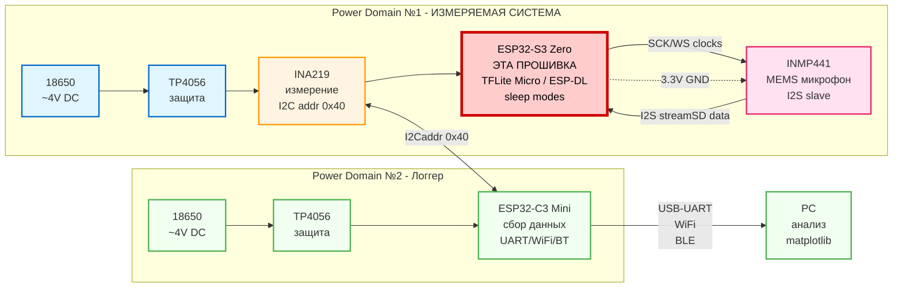

# ESP32-S3 Voice Recognition Firmware

Энергоэффективная прошивка для распознавания речи на ESP32-S3 с использованием
TensorFlow Lite Micro и ESP-DL.

## Описание

Эта прошивка реализует keyword spotting (распознавание ключевых слов) на
микроконтроллере ESP32-S3 с минимальным энергопотреблением. Использует MEMS
микрофон INMP441 для захвата аудио и квантизированные нейронные сети для
inference.

## Возможности

- Захват аудио через I2S (INMP441 микрофон)
- TensorFlow Lite Micro inference
- ESP-DL модели (keyword spotting, speech commands)
- Поддержка режимов энергосбережения (Light Sleep / Deep Sleep)
- Логирование энергопотребления (интеграция с внешним INA219)
- SIMD оптимизации (Xtensa LX7)

## Место в системе прототипа

Эта прошивка работает на **ESP32-S3 Zero** (выделена красным на схеме ниже) в
составе измерительной системы:

|  |
| ------------------------------------------------------------------------------------------------------------------------------------------------------- |

<details>
<summary>Исходный код диаграммы (Mermaid)</summary>



</details>

**Примечание:** Прошивка работает автономно на ESP32-S3 с микрофоном. INA219 и
ESP32-C3 используются только для измерения энергопотребления и не требуются для
базовой функциональности.

---

## Архитектура фреймворков и моделей

### ESP-SR / ESP-Skainet / ESP-DL — что есть что

**ESP-DL** — низкоуровневый фреймворк для запуска нейронных сетей на ESP32.
Предоставляет оптимизированные операции (SIMD на Xtensa LX7), слои для
построения и запуска произвольных моделей. Аналог TFLite Micro, но заточен под
железо Espressif.

**ESP-SR** (Speech Recognition) — фреймворк более высокого уровня, построен
поверх ESP-DL. Содержит готовые предобученные модели для работы со звуком:
WakeNet, MultiNet, AFE.

**ESP-Skainet** — набор примеров и готовых пайплайнов для голосовых приложений
на базе ESP-SR. По сути это "reference implementation" для продуктов с голосовым
управлением.

```
ESP-Skainet (примеры и пайплайны)
    └── ESP-SR (WakeNet, MultiNet, AFE)
            └── ESP-DL (операции, квантизация, inference)
                    └── ESP-IDF (железо, I2S, память)
```

### AFE — Audio Front End

AFE — это препроцессинг аудиосигнала перед подачей в нейронку. Включает:

- **Шумоподавление (NS)** — убирает фоновый шум
- **Акустическое эхоподавление (AEC)** — убирает эхо от динамика
- **Автоматическое усиление (AGC)** — нормализует громкость

Без AFE точность распознавания в реальных условиях падает существенно.
Потребление памяти AFE при конфигурации MR, SR, LOW_COST: ~73KB internal RAM +
~733KB PSRAM.

### WakeNet

WakeNet — нейросеть для детекции wake word ("Привет, ESP", "Alexa" и т.д.).
Работает непрерывно в фоне, слушает поток с микрофона и детектирует конкретное
слово-триггер. Именно она определяет момент когда пользователь "обращается" к
устройству.

Ключевые характеристики WakeNet9 (квантизированная):

- Internal RAM: 16–20 KB
- PSRAM: 324–347 KB
- Время инференса: 3.0–4.3 ms на фрейм (32 ms)
- Точность в тишине: 98%, при шуме SNR=4dB: 94–96%
- False trigger rate: раз в 12 часов

WakeNet — это полноценная нейронная сеть с достаточно богатым набором
поддерживаемых wake words. Для целей диплома (энергоэффективность + голосовое
управление) это идеальный выбор: можно исследовать потребление в режиме
постоянного прослушивания, измерять разницу между active inference и sleep
modes, и при этом система реально реагирует на голосовые команды.

### MultiNet

MultiNet — нейросеть для распознавания голосовых команд. Запускается после
срабатывания WakeNet и определяет что именно сказал пользователь из заданного
набора команд.

Характеристики MultiNet4 Q8 (самая лёгкая версия):

- Internal RAM: 10.5 KB
- PSRAM: 1009 KB
- Время инференса: 11 ms на фрейм

---

## Аппаратные ограничения и анализ feasibility

### Реальные характеристики платы

Плата: **Waveshare ESP32-S3 Zero (S3FH4R2)**

Фактические характеристики, подтверждённые esptool при прошивке:

- Flash: **2 MB** (несмотря на то что маркировка S3FH4R2 теоретически
  подразумевает 4 MB — железо говорит 2 MB)
- PSRAM: **2 MB** (Quad SPI, подтверждено схематикой Waveshare)
- Internal RAM: 320 KB

### Почему полный стек ESP-SR не влезает

Минимальный рабочий стек для распознавания команд:

| Компонент      | Flash (веса) | PSRAM (runtime) |
| -------------- | ------------ | --------------- |
| Прошивка + код | ~800 KB      | —               |
| AFE (LOW_COST) | —            | ~733 KB         |
| WakeNet9       | ~400 KB      | ~324 KB         |
| MultiNet4 Q8   | ~1000 KB     | ~1009 KB        |
| **Итого**      | **~2200 KB** | **~2066 KB**    |

Flash переполнена: нужно ~2.2 MB, доступно 2 MB. PSRAM тоже на грани: нужно ~2
MB, доступно ровно 2 MB без запаса на стек и буферы.

**Почему нельзя просто квантизировать сильнее:** Модели WakeNet и MultiNet уже
квантизированы до 8 бит (INT8/Q8) — это минимальная точность квантизации при
которой модели остаются практически применимыми. Переход на INT4 через чистый
ESP-DL приводит к катастрофическому падению точности: нейронка начинает путать
тишину с командами, ложные срабатывания становятся неприемлемыми для любого
реального применения.

### Выбранное решение

Учитывая что **основная тема диплома — энергоэффективность**, а не максимальная
функциональность распознавания, принято решение использовать только **WakeNet9
без MultiNet**. Это даёт:

- Детекцию wake word с точностью 94–98% в зависимости от условий
- Возможность исследовать потребление в режиме continuous listening
- Возможность исследовать переходы Active → Light Sleep → Deep Sleep
- Реакцию на голосовой триггер как событие для измерений

Полноценное распознавание произвольных команд (MultiNet) остаётся за рамками
текущей аппаратной конфигурации и требует платы с минимум 4 MB Flash.

---

## Требования

### Железо

- ESP32-S3 (любая плата с USB, например Waveshare ESP32-S3-Zero)
- INMP441 MEMS микрофон
- (Опционально) INA219 для измерения энергопотребления

### Софт

- ESP-IDF v5.1 или новее
- PlatformIO (используется в проекте)
- Python 3.8+
- Git

## Быстрый старт

### 1. Клонирование репозитория

```bash
git clone https://github.com/yourusername/edge-ai-voice-recognition.git
cd edge-ai-voice-recognition
```

### 2. Сборка и прошивка через PlatformIO

```bash
# Сборка
pio run

# Прошивка
pio run -t upload

# Мониторинг логов
pio device monitor
```

### 3. Menuconfig (настройка ESP-IDF параметров)

```bash
pio run -t menuconfig
```

## Подключение оборудования

### INMP441 Микрофон

| INMP441 Pin | ESP32-S3 Pin | Описание           |
| ----------- | ------------ | ------------------ |
| VDD         | 3.3V         | Питание            |
| GND         | GND          | Земля              |
| WS          | GPIO4        | Word Select (I2S)  |
| SCK         | GPIO5        | Serial Clock (I2S) |
| SD          | GPIO6        | Serial Data (I2S)  |
| L/R         | GND          | Левый канал        |

### Схема подключения

```
ESP32-S3           INMP441
  3.3V  ────────── VDD
  GND   ────────── GND
  GPIO4 ────────── WS
  GPIO5 ────────── SCK
  GPIO6 ────────── SD
         ────────── L/R (→ GND)
```

## Структура проекта

```
edge-ai-voice-recognition/
├── src/
│   └── main.c              # Точка входа (esp-idf app_main)
├── components/             # Внешние компоненты (esp-sr и др.)
├── models/
│   └── wakenet/            # Веса WakeNet9
├── platformio.ini          # Конфигурация PlatformIO
├── sdkconfig.esp32-s3-devkitc-1  # Конфиг ESP-IDF (menuconfig)
├── CMakeLists.txt
└── README.md
```

## Конфигурация I2S

Прошивка использует следующие настройки I2S:

```c
i2s_config_t i2s_config = {
    .mode = I2S_MODE_MASTER | I2S_MODE_RX,
    .sample_rate = 16000,           // 16 kHz для речи
    .bits_per_sample = I2S_BITS_PER_SAMPLE_32BIT,
    .channel_format = I2S_CHANNEL_FMT_ONLY_LEFT,
    .communication_format = I2S_COMM_FORMAT_I2S,
    .intr_alloc_flags = ESP_INTR_FLAG_LEVEL1,
    .dma_buf_count = 4,
    .dma_buf_len = 1024,
};
```

## Режимы энергосбережения

Прошивка поддерживает три режима работы:

| Режим           | Потребление | Описание                 |
| --------------- | ----------- | ------------------------ |
| **Active**      | ~60-80 mA   | AI inference активен     |
| **Light Sleep** | ~0.8 mA     | CPU спит, wake on timer  |
| **Deep Sleep**  | ~10 µA      | Только RTC, wake on GPIO |

### Пример использования Light Sleep

```c
// Включить режим light sleep между inference
esp_sleep_enable_timer_wakeup(100000); // 100ms
esp_light_sleep_start();
```

## Модели

### WakeNet9 (используется)

Предобученная квантизированная (INT8) нейросеть для детекции wake word.
Оптимизирована под Xtensa LX7 SIMD инструкции. Поддерживает набор готовых wake
words от Espressif, а также кастомные через ESP-SR SDK.

### TensorFlow Lite Micro (планируется)

Для кастомных моделей keyword spotting. Формат модели: входной тензор
`[1, 16000, 1]`, квантизация int8, размер ~200-300 KB.

## Производительность (ESP32-S3 @ 240 MHz)

| Компонент           | Время        | Потребление |
| ------------------- | ------------ | ----------- |
| WakeNet9 inference  | 3–4 ms/фрейм | ~60–70 mA   |
| I2S capture latency | ~64 ms       | —           |
| Light Sleep пауза   | настраиваемо | ~0.8 mA     |

---

## Текущий статус и прогресс

### Сделано

- Настроена среда разработки: PlatformIO + ESP-IDF v5.4.0
- Настроен LSP (clangd) для разработки в Neovim с полноценными подсказками и
  go-to-definition
- Плата прошивается и работает, базовые логи через UART читаются
- Проверены и настроены параметры PSRAM (Quad SPI, 2MB)
- Изучены аппаратные ограничения платы, выбрана стратегия с WakeNet9

### В процессе

- Подключение INMP441 по I2S
- Интеграция WakeNet9 через ESP-SR
- Базовые замеры потребления (active vs sleep)

### Известные проблемы

**Flash 2MB вместо 4MB:** Маркировка S3FH4R2 теоретически означает 4MB flash, но
esptool при прошивке детектирует 2MB. Это подтверждено несколькими способами.
Из-за этого полный стек ESP-SR (WakeNet + MultiNet) не влезает, используется
только WakeNet.

**Конфиг platformio.ini под devkitc-1:** Плата позиционируется как
ESP32-S3-DevKitC-1 в конфиге, что не совсем точно (у DevKitC 8MB flash). Это
вызывает предупреждение "Flash size mismatch" при сборке без явного указания
flash_size. Текущий workaround — явно указывать `board_build.flash_size = 2MB`.

---

## TODO

- [ ] Подключить INMP441, проверить I2S поток
- [ ] Интегрировать WakeNet9, получить первое срабатывание
- [ ] Замерить потребление через INA219: active inference vs light sleep vs deep
      sleep
- [ ] Wake-on-voice через ULP (ультра низкое потребление в режиме ожидания)
- [ ] Streaming inference (без буферизации)
- [ ] ? OTA обновление моделей
- [ ] ?? Интеграция с Home Assistant

## Лицензия

MIT License

## Благодарности

- [ESP-IDF](https://github.com/espressif/esp-idf)
- [ESP-SR](https://github.com/espressif/esp-sr)
- [ESP-Skainet](https://github.com/espressif/esp-skainet)
- [TensorFlow Lite Micro](https://github.com/tensorflow/tflite-micro)
- [ESP-DL](https://github.com/espressif/esp-dl)
