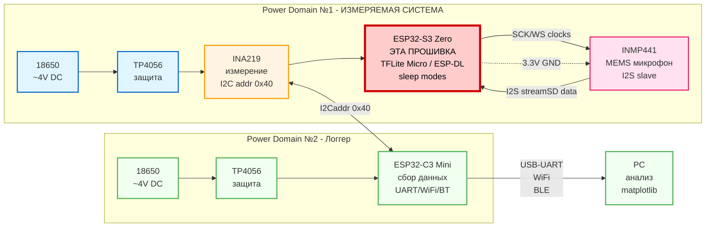
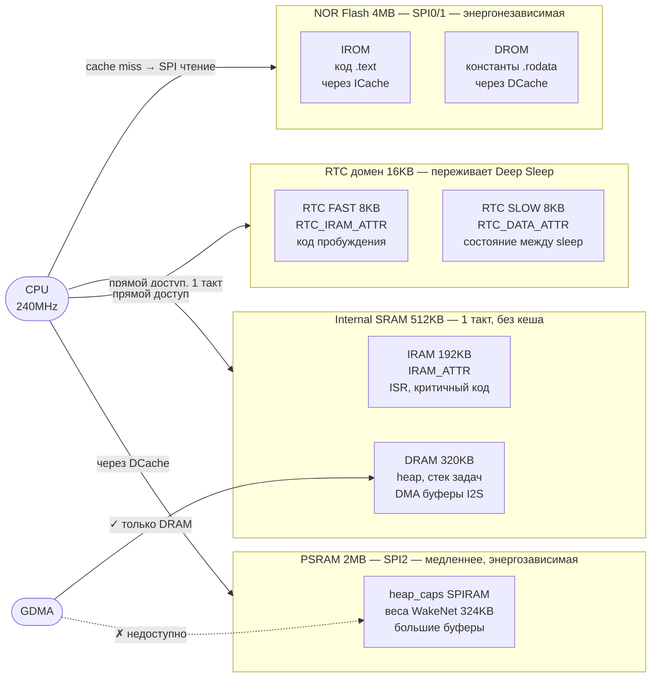

# ESP32-S3 Voice Recognition Firmware

Энергоэффективная прошивка для распознавания речи на ESP32-S3 с использованием
TensorFlow Lite Micro и ESP-DL.

## Описание

Эта прошивка реализует keyword spotting (распознавание ключевых слов) на
микроконтроллере ESP32-S3 с минимальным энергопотреблением. Использует MEMS
микрофон INMP441 для захвата аудио и квантизированные нейронные сети для
inference.

## Возможности

- Захват аудио через I2S (INMP441 микрофон)
- TensorFlow Lite Micro inference
- ESP-DL модели (keyword spotting, speech commands)
- Поддержка режимов энергосбережения (Light Sleep / Deep Sleep)
- Логирование энергопотребления (интеграция с внешним INA219)
- SIMD оптимизации (Xtensa LX7)

## Место в системе прототипа

Эта прошивка работает на **ESP32-S3 Zero** (выделена красным на схеме ниже) в
составе измерительной системы:

|  |
| ------------------------------------------------------------------------------------------------------------------------------------------------------- |

<details>
<summary>Исходный код диаграммы (Mermaid)</summary>



</details>

**Примечание:** Прошивка работает автономно на ESP32-S3 с микрофоном. INA219 и
ESP32-C3 используются только для измерения энергопотребления и не требуются для
базовой функциональности.

---

## Архитектура фреймворков и моделей

### ESP-SR / ESP-Skainet / ESP-DL — что есть что

**ESP-DL** — низкоуровневый фреймворк для запуска нейронных сетей на ESP32.
Предоставляет оптимизированные операции (SIMD на Xtensa LX7), слои для
построения и запуска произвольных моделей. Аналог TFLite Micro, но заточен под
железо Espressif.

**ESP-SR** (Speech Recognition) — фреймворк более высокого уровня, построен
поверх ESP-DL. Содержит готовые предобученные модели для работы со звуком:
WakeNet, MultiNet, AFE.

**ESP-Skainet** — набор примеров и готовых пайплайнов для голосовых приложений
на базе ESP-SR. По сути это "reference implementation" для продуктов с голосовым
управлением.

```
ESP-Skainet (примеры и пайплайны)
    └── ESP-SR (WakeNet, MultiNet, AFE)
            └── ESP-DL (операции, квантизация, inference)
                    └── ESP-IDF (железо, I2S, память)
```

### AFE — Audio Front End

AFE — это препроцессинг аудиосигнала перед подачей в нейронку. Включает:

- **Шумоподавление (NS)** — убирает фоновый шум
- **Акустическое эхоподавление (AEC)** — убирает эхо от динамика
- **Автоматическое усиление (AGC)** — нормализует громкость

Без AFE точность распознавания в реальных условиях падает существенно.
Потребление памяти AFE при конфигурации MR, SR, LOW_COST: ~73KB internal RAM +
~733KB PSRAM.

### WakeNet

WakeNet — нейросеть для детекции wake word ("Привет, ESP", "Alexa" и т.д.).
Работает непрерывно в фоне, слушает поток с микрофона и детектирует конкретное
слово-триггер. Именно она определяет момент когда пользователь "обращается" к
устройству.

Ключевые характеристики WakeNet9 (квантизированная):

- Internal RAM: 16–20 KB
- PSRAM: 324–347 KB
- Время инференса: 3.0–4.3 ms на фрейм (32 ms)
- Точность в тишине: 98%, при шуме SNR=4dB: 94–96%
- False trigger rate: раз в 12 часов

WakeNet — это полноценная нейронная сеть с достаточно богатым набором
поддерживаемых wake words. Для целей диплома (энергоэффективность + голосовое
управление) это идеальный выбор: можно исследовать потребление в режиме
постоянного прослушивания, измерять разницу между active inference и sleep
modes, и при этом система реально реагирует на голосовые команды.

### MultiNet

MultiNet — нейросеть для распознавания голосовых команд. Запускается после
срабатывания WakeNet и определяет что именно сказал пользователь из заданного
набора команд.

Характеристики MultiNet4 Q8 (самая лёгкая версия):

- Internal RAM: 10.5 KB
- PSRAM: 1009 KB
- Время инференса: 11 ms на фрейм

---

## Аппаратные ограничения и анализ feasibility

### Реальные характеристики платы

Плата: **Waveshare ESP32-S3 Zero (S3FH4R2)**

Фактические характеристики, подтверждённые `esptool flash_id`:

- Flash: **4 MB** (JEDEC `Device: 4016` = 2^22 байт)
- PSRAM: **2 MB** (Quad SPI, подтверждено схематикой Waveshare)
- Internal RAM: 320 KB

### Архитектура памяти чипа

[Полная карта адресного пространства](./docs/esp32s3-mm.pdf) (официальный Memory
Map, Espressif)



**ICache и DCache** — hardware кеши между CPU и внешней памятью (Flash, PSRAM).
ICache (16–32KB) кеширует инструкции из Flash. DCache (32–64KB) кеширует данные
из Flash и PSRAM. Работают по принципу set-associative: при обращении к адресу
контроллер проверяет есть ли строка в кеше — cache hit значит данные уже в SRAM
(быстро), cache miss значит нужно читать по SPI (медленно, ~10–40 тактов).
Именно поэтому `IRAM_ATTR` убирает недетерминизм в ISR: код в IRAM минует кеш
полностью.

**GDMA** (General-purpose DMA) — централизованный контроллер прямого доступа к
памяти. Вместо отдельного DMA у каждой периферии, в ESP32-S3 один GDMA с
несколькими каналами — через него ходят I2S, SPI, SDMMC. Смысл DMA: периферия
пишет данные прямо в RAM без участия CPU, CPU получает прерывание только когда
буфер заполнен. GDMA подключён к Internal SRAM по D-bus напрямую и физически не
имеет доступа к SPI шине где сидит PSRAM — поэтому DMA буферы обязаны лежать в
DRAM.

**Inference из PSRAM через DCache**: при старте WakeNet читает файлы весов из
SPIFFS (NOR Flash) и копирует их в PSRAM через
`heap_caps_malloc(MALLOC_CAP_SPIRAM)`. При каждом фрейме (16ms) нейронка читает
веса из PSRAM — CPU идёт через DCache. Первое обращение к строке весов — cache
miss, данные подгружаются по SPI2. Все последующие обращения к той же строке —
cache hit, данные уже в кеше.

| Тип           | Размер | Доступ CPU           | Энергозав. | DMA    | Deep Sleep | Атрибут в коде          |
| ------------- | ------ | -------------------- | ---------- | ------ | ---------- | ----------------------- |
| **ROM**       | 448KB  | 1 такт               | **да**     | нет    | —          | нет (read-only)         |
| **IRAM**      | 192KB  | 1 такт, без кеша     | нет        | нет    | нет        | `IRAM_ATTR`             |
| **DRAM**      | 320KB  | 1 такт, без кеша     | нет        | **да** | нет        | `DMA_ATTR`, `DRAM_ATTR` |
| **RTC FAST**  | 8KB    | прямой               | нет        | нет    | **да**     | `RTC_IRAM_ATTR`         |
| **RTC SLOW**  | 8KB    | прямой               | нет        | нет    | **да**     | `RTC_DATA_ATTR`         |
| **NOR Flash** | 4MB    | через ICache/DCache  | **да**     | нет    | **да**     | нет (partition table)   |
| **PSRAM**     | 2MB    | через DCache, ~40MHz | нет        | нет    | нет        | `EXT_RAM_BSS_ATTR`      |

> RTC FAST и RTC SLOW — два субрегиона единого RTC SRAM (16KB суммарно). FAST
> доступен по I-bus (можно исполнять код), SLOW только по D-bus (только данные).

**Атрибуты размещения** — макросы которые переопределяют решение линкера о том
куда положить переменную или функцию. По умолчанию линкер кладёт код в Flash
(дёшево по RAM, но медленно при cache miss), константы туда же, данные в DRAM.
Атрибут это явная инструкция "положи вот сюда". Пример: без `IRAM_ATTR` на ISR
прерывание может подвиснуть на ~40 тактов пока Flash читается по SPI — для аудио
обработки это недопустимо.

```c
// ISR без IRAM_ATTR — код в Flash, cache miss возможен
void i2s_isr(void *arg) { ... }

// ISR с IRAM_ATTR — код в IRAM, 1 такт гарантировано
void IRAM_ATTR i2s_isr(void *arg) { ... }

// DMA буфер — обязательно DRAM, иначе GDMA упадёт
DMA_ATTR static int32_t i2s_rx_buf[512];

// состояние между Deep Sleep циклами
RTC_DATA_ATTR int wake_count = 0;
```

**Для диплома по энергоэффективности:**

- **RTC SLOW** — счётчики пробуждений и флаги состояния переживут Deep Sleep
- **IRAM** — `IRAM_ATTR` на inference loop убирает cache miss и делает время
  выполнения фрейма предсказуемым — важно для точных замеров потребления
- **Deep Sleep** — всё кроме RTC домена обесточивается; PSRAM (и веса WakeNet)
  теряются, при пробуждении нужна повторная инициализация esp-sr

**Почему I2S требует DRAM:**

I2S при каждом сэмпле просит GDMA записать данные прямо в RAM. GDMA физически не
умеет работать с PSRAM — у него нет доступа к внешней SPI шине, только к
Internal SRAM. Поэтому любой буфер который I2S/SPI/SDMMC читает через DMA должен
лежать в DRAM:

```c
// правильно — статический DMA буфер в DRAM
DMA_ATTR static int32_t i2s_buf[512];

// неправильно — PSRAM, GDMA упадёт
int32_t *buf = heap_caps_malloc(512 * 4, MALLOC_CAP_SPIRAM);
```

В sdkconfig зарезервировано 32KB internal RAM под DMA нужды esp-sr и I2S:
`CONFIG_SPIRAM_MALLOC_RESERVE_INTERNAL=32768`.

### Разметка Flash и partition table

Flash размечается через `partitions.csv`. `gen_esp32part.py` компилирует его в
бинарную таблицу (массив 32-байтных записей) и прошивает по `0x8000`. Bootloader
читает её при каждом старте и монтирует разделы.

```
Адрес     Размер   Раздел           Назначение
─────────────────────────────────────────────────────────────────
0x00000    ~24KB   bootloader       ROM прыгает сюда при reset.
                                    ESP32-S3: 0x0000
                                    Классический ESP32: 0x1000
0x08000      4KB   partition table  Скомпилированный partitions.csv
0x09000     24KB   nvs              Ключ/значение хранилище.
                                    esp-sr использует внутри при
                                    инициализации — без него падает.
0x10000    900KB   factory          Прошивка. Жёсткий стандарт
                                    esp-idf — bootloader ищет app
                                    именно здесь. Не менять.
0xF1000    600KB   model (SPIFFS)   Веса WakeNet9.
                                    0x10000 + 900×1024 = 0xF1000
─────────────────────────────────────────────────────────────────
Итого: ~1524KB из 4096KB. Остаток ~2.5MB — резерв.
```

Текущий `partitions.csv`:

```csv
# Name,     Type,  SubType,  Offset,    Size
# ---------------------------------------------------
# 0x00000 - bootloader (ESP32-S3: 0x0000, старые чипы: 0x1000)
# 0x08000 - partition table (этот файл)
# ---------------------------------------------------
nvs,        data,  nvs,      0x9000,    0x6000
factory,    app,   factory,  0x10000,   900K
model,      data,  spiffs,   0xF1000,   600K
```

**Почему SPIFFS для model:** веса нейронки хранятся как файлы.
`esp_srmodel_init("model")` монтирует раздел как SPIFFS и читает файлы
`wn9_data`/`wn9_index` через VFS (`fopen("/spiffs/...")`). Данные read-only —
wear leveling не критичен.

### Почему полный стек ESP-SR не влезает по PSRAM

| Компонент      | Flash (веса) | PSRAM (runtime) |
| -------------- | ------------ | --------------- |
| Прошивка + код | ~800 KB      | —               |
| AFE (LOW_COST) | —            | ~733 KB         |
| WakeNet9       | ~400 KB      | ~324 KB         |
| MultiNet4 Q8   | ~1000 KB     | ~1009 KB        |
| **Итого**      | **~2200 KB** | **~2066 KB**    |

По Flash с 4MB влезает. Но PSRAM на грани: нужно ~2066KB, доступно 2048KB — нет
запаса на стек и буферы. MultiNet не используется.

**Почему нельзя просто квантизировать сильнее:** Модели WakeNet и MultiNet уже
квантизированы до 8 бит (INT8/Q8) — это минимальная точность квантизации при
которой модели остаются практически применимыми. Переход на INT4 через чистый
ESP-DL приводит к катастрофическому падению точности: нейронка начинает путать
тишину с командами, ложные срабатывания становятся неприемлемыми для любого
реального применения.

### Выбранное решение

Учитывая что **основная тема диплома — энергоэффективность**, а не максимальная
функциональность распознавания, принято решение использовать только **WakeNet9
без MultiNet**. Это даёт:

- Детекцию wake word с точностью 94–98% в зависимости от условий
- Возможность исследовать потребление в режиме continuous listening
- Возможность исследовать переходы Active → Light Sleep → Deep Sleep
- Реакцию на голосовой триггер как событие для измерений

---

## Требования

### Железо

- ESP32-S3 (любая плата с USB, например Waveshare ESP32-S3-Zero)
- INMP441 MEMS микрофон
- (Опционально) INA219 для измерения энергопотребления

### Софт

- ESP-IDF v5.4.0
- PlatformIO
- Python 3.8+
- Git

## Быстрый старт

### 1. Клонирование репозитория

```bash
git clone https://github.com/yourusername/edge-ai-voice-recognition.git
cd edge-ai-voice-recognition
```

### 2. Сборка и прошивка

```bash
pio run -t upload
pio device monitor
```

### 3. Прошивка модели WakeNet (только первый раз)

PlatformIO прошивает только firmware. Веса нейронки нужно прошить один раз
вручную — после этого они остаются в flash при любых перепрошивках firmware.

```bash
# Генерируем srmodels.bin из весов в managed_components
cd managed_components/espressif__esp-sr/model
python movemodel.py \
  -d1 ../../../sdkconfig.esp32-s3-devkitc-1 \
  -d2 .. \
  -d3 ../../../.pio/build/esp32-s3-devkitc-1
cd ../../../

# Прошиваем в model раздел
python ~/.platformio/packages/tool-esptoolpy/esptool.py \
  --chip esp32s3 --port /dev/ttyACM0 --baud 460800 \
  write_flash 0xF1000 \
  .pio/build/esp32-s3-devkitc-1/srmodels/srmodels.bin
```

Повторять только при смене модели в menuconfig или полном стирании flash.

## Подключение оборудования

### INMP441 Микрофон

| INMP441 Pin | ESP32-S3 Pin | Описание           |
| ----------- | ------------ | ------------------ |
| VDD         | 3.3V         | Питание            |
| GND         | GND          | Земля              |
| WS          | GPIO4        | Word Select (I2S)  |
| SCK         | GPIO5        | Serial Clock (I2S) |
| SD          | GPIO6        | Serial Data (I2S)  |
| L/R         | GND          | Левый канал        |

### Схема подключения

```
ESP32-S3           INMP441
  3.3V  ────────── VDD
  GND   ────────── GND
  GPIO4 ────────── WS
  GPIO5 ────────── SCK
  GPIO6 ────────── SD
         ────────── L/R (→ GND)
```

## Структура проекта

```
edge-ai-voice-recognition/
├── src/
│   ├── main.c              # Точка входа
│   ├── i2s_mic.c           # I2S захват аудио (INMP441)
│   └── i2s_mic.h
├── partitions.csv          # Разметка Flash
├── platformio.ini
├── sdkconfig.esp32-s3-devkitc-1
├── idf_component.yml       # esp-sr dependency
└── CMakeLists.txt
```

## Режимы энергосбережения

| Режим           | Потребление | Описание                  |
| --------------- | ----------- | ------------------------- |
| **Active**      | ~60-80 mA   | WakeNet inference активен |
| **Light Sleep** | ~0.8 mA     | CPU спит, wake on timer   |
| **Deep Sleep**  | ~10 µA      | Только RTC SRAM живёт     |

RTC SRAM (16KB) переживает Deep Sleep — туда пишем состояние между циклами:

```c
RTC_DATA_ATTR int wake_count = 0;  // сохранится после deep sleep
```

## Модели

### WakeNet9 (используется)

Предобученная квантизированная (INT8) нейросеть для детекции wake word.
Оптимизирована под Xtensa LX7 SIMD инструкции. Поддерживает набор готовых wake
words от Espressif, а также кастомные через ESP-SR SDK.

### TensorFlow Lite Micro (планируется)

Для кастомных моделей keyword spotting. Формат модели: входной тензор
`[1, 16000, 1]`, квантизация int8, размер ~200-300 KB.

## Производительность (ESP32-S3 @ 240 MHz)

| Компонент          | Время        | Потребление |
| ------------------ | ------------ | ----------- |
| WakeNet9 inference | 3–4 ms/фрейм | ~60–70 mA   |
| I2S capture        | ~64 ms       | —           |

---

## Текущий статус и прогресс

### Сделано

- Настроена среда разработки: PlatformIO + ESP-IDF v5.4.0
- Настроен LSP (clangd) в Neovim: автодополнение, go-to-definition, rename
- Плата прошивается, PSRAM работает (Quad SPI, 2MB, подтверждено)
- Flash детектирован как 4MB через `esptool flash_id` (JEDEC `4016`), исправлен
  sdkconfig
- Написан и протестирован драйвер INMP441 по I2S (Philips, 32bit, 16kHz mono)
- I2S читает аудио корректно: уровень в тишине ~100, при звуке ~3000+
- Интегрирован WakeNet9 (`wn9_hiesp`) через ESP-SR
- Веса модели прошиты в SPIFFS раздел, модель инициализируется успешно
- Разработана и задокументирована разметка Flash

### В процессе

- Подключение выхода WakeNet к циклу чтения I2S (детекция на реальном аудио)
- Замеры потребления через INA219: active inference vs sleep modes

### Известные проблемы

**PlatformIO не прошивает srmodels.bin:** PlatformIO не запускает cmake таргет
`srmodels_bin` из esp-sr при upload. Веса WakeNet нужно прошивать вручную через
esptool один раз (см. Быстрый старт → п.3). В нативном `idf.py flash` это
происходит автоматически через `add_dependencies(flash srmodels_bin)`.

---

## TODO

## TODO

- [ ] Подключить WakeNet к I2S потоку, получить первое срабатывание на голос
- [ ] Замерить потребление: active inference vs light sleep vs deep sleep
- [ ] Wake-on-voice через ULP
- [ ] ? OTA обновление моделей

## Лицензия

MIT License

## Благодарности

- [ESP-IDF](https://github.com/espressif/esp-idf)
- [ESP-SR](https://github.com/espressif/esp-sr)
- [ESP-Skainet](https://github.com/espressif/esp-skainet)
- [TensorFlow Lite Micro](https://github.com/tensorflow/tflite-micro)
- [ESP-DL](https://github.com/espressif/esp-dl)
